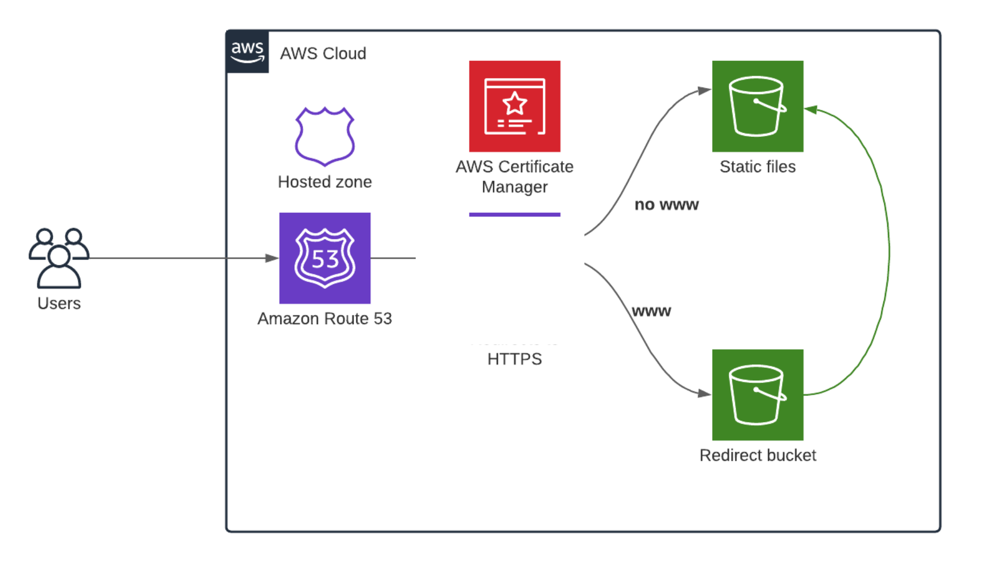

# AWS Static Website Hosting with Terraform

This project sets up an infrastructure on AWS to host a static website using Amazon S3, Route 53, and AWS Certificate Manager (ACM) with HTTPS enabled. The setup redirects users from the `www` subdomain to the root domain (or vice versa) and serves static files securely over HTTPS.

## Architecture Overview



1. **Amazon S3**: Two S3 buckets are used:
   - **Static Files Bucket**: Hosts the website's static files.
   - **Redirect Bucket**: Redirects traffic from `www` to the root domain (or vice versa).
   
2. **AWS Certificate Manager (ACM)**: Manages SSL/TLS certificates for HTTPS traffic.

3. **Amazon Route 53**: DNS service that routes traffic to the S3 buckets.

4. **Hosted Zone**: Used to manage the domain and its records.

## Prerequisites

Before deploying this infrastructure, make sure you have:

- An AWS account with appropriate IAM permissions.
- [Terraform](https://www.terraform.io/downloads.html) installed.
- A registered domain in Route 53 or another domain registrar.

## Setup Instructions

1. **Clone the Repository**

   ```bash
   git clone https://github.com/your-username/your-repo-name.git
   cd your-repo-name

